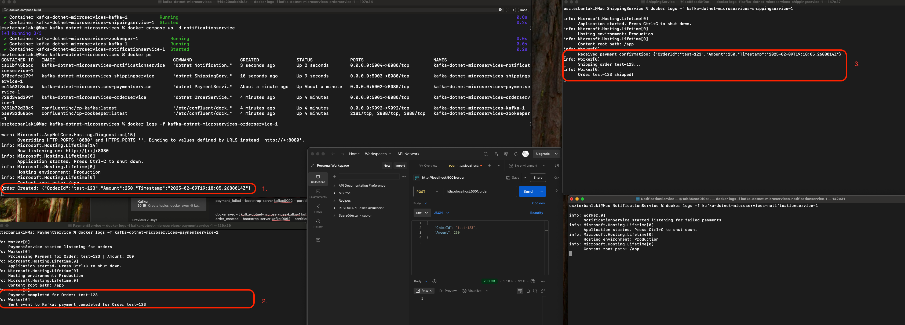
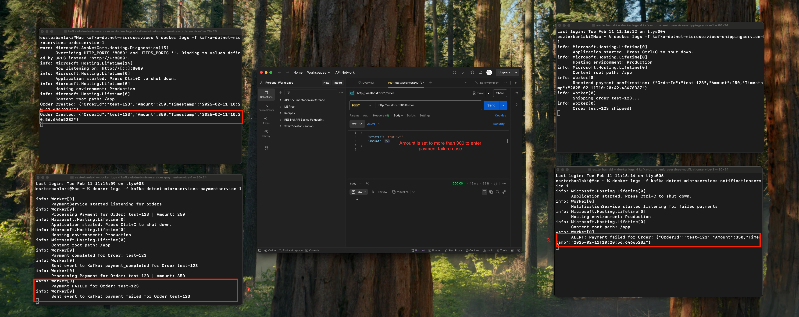

# Event-Driven Microservices with .NET and Kafka

## Overview

The application simulates a **mini webshop**, where different services handle order processing, payment transactions, shipping, and notifications asynchronously using Kafka as the event broker.
This project demonstrates an **event-driven microservices architecture** using **ASP.NET Core** and **Kafka**.
No DB is connected to this project, we just only show console messages after an event. No authentication is implemented, only having basic error-handling.
The application is docerized, using docker compose. 

***This application is only a short demonstration made by fun and not a real service.***

## Services and wokrflow:

1. **OrderService** - Accepts orders and publishes an `order_created` event: ASP.NET Core Web API.
2. **PaymentService** - Listens for `order_created`, processes the payment, and publishes either `payment_completed` or `payment_failed`: .NET Background Worker Service.
3. **ShippingService** - Listens for `payment_completed` and handles order shipping (in this example just logging): .NET Background Worker Service.
4. **NotificationService** - Listens for `payment_failed` and sends alerts: .NET Background Worker Service.

### What This Application Demonstrates:

- **Decoupled architecture**, where services operate independently and interact through events (**Event-driven communication**).
- **Basic error handling**.
- **Kafka topic management and message logging**.
- **Structured API responses**.
- **Dockerization** of each services

## API Responses

Each service provides structured responses. Example:

**OrderService Response (on success)**:

```json
{
    "status": "success",
    "message": "Order Created",
    "orderId": "123"
}
```

**PaymentService Response (on failure)**:

```json
{
    "status": "error",
    "message": "Payment failed due to insufficient funds",
    "orderId": "fail-123"
}
```

## Initialization

### **Running the Project**

1. **Clone the repository:**

   ```sh
   git clone https://github.com/your-repo/kafka-dotnet-microservices.git
   cd kafka-dotnet-microservices
   ```

2. **Start the system using Docker Compose:**

   ```sh
   docker-compose up -d --build
   ```

3. **Verify that all containers are running:**

   ```sh
   docker ps
   ```

### **Manually Creating Kafka Topics**

1. If topics are not automatically created, use the following commands:

```sh
docker exec -it kafka-dotnet-microservices-kafka-1 kafka-topics --create --topic order_created --bootstrap-server kafka:9092 --partitions 1 --replication-factor 1

docker exec -it kafka-dotnet-microservices-kafka-1 kafka-topics --create --topic payment_completed --bootstrap-server kafka:9092 --partitions 1 --replication-factor 1

docker exec -it kafka-dotnet-microservices-kafka-1 kafka-topics --create --topic payment_failed --bootstrap-server kafka:9092 --partitions 1 --replication-factor 1
```
2. List Kafka topics:

```sh
docker exec -it kafka-dotnet-microservices-kafka-1 kafka-topics --list --bootstrap-server kafka:9092
```

Expected output:

```plaintext
order_created
payment_completed
payment_failed
```


## Testing the System

### 1. Creating an Order

To simulate an order, send a `POST` request to **OrderService**:

- **URL:** `http://localhost:5001/order`
- **Method:** `POST`
- **Body:**
  ```json
  {
      "OrderId": "123",
      "Amount": 50
  }
  ```
- **Expected Behavior:**
  - OrderService publishes `order_created`.
  - PaymentService processes the order and publishes `payment_completed`.
  - ShippingService receives `payment_completed` and ships the order.
 
      


### 2. Simulating a Failed Payment

To trigger a failed payment, send an order with an **Amount > 300** (I added this to the code deliberately to easily demonstrate different event production in payment service):

- **URL:** `http://localhost:5001/order`
- **Method:** `POST`
- **Body:**
  ```json
  {
      "OrderId": "fail-123",
      "Amount": 350
  }
  ```
- **Expected Behavior:**
  - PaymentService detects failure and publishes `payment_failed`.
  - NotificationService receives `payment_failed` and logs an alert.
 
    

## Verifying Kafka Messages

To confirm that messages are flowing correctly, you can check Kafka topics.

To see messages flowing through Kafka:

```sh
docker exec -it kafka-dotnet-microservices-kafka-1 kafka-console-consumer --bootstrap-server kafka:9092 --topic order_created --from-beginning
```

Or you can log the services one-by-one. Here is the example commnad, (change the service name for paymentservice, shippingservice or notificationservice):
```sh
docker logs -f kafka-dotnet-microservices-orderservice-1
```


## Stopping the System

To shut down all services:

```sh
docker-compose down
```

